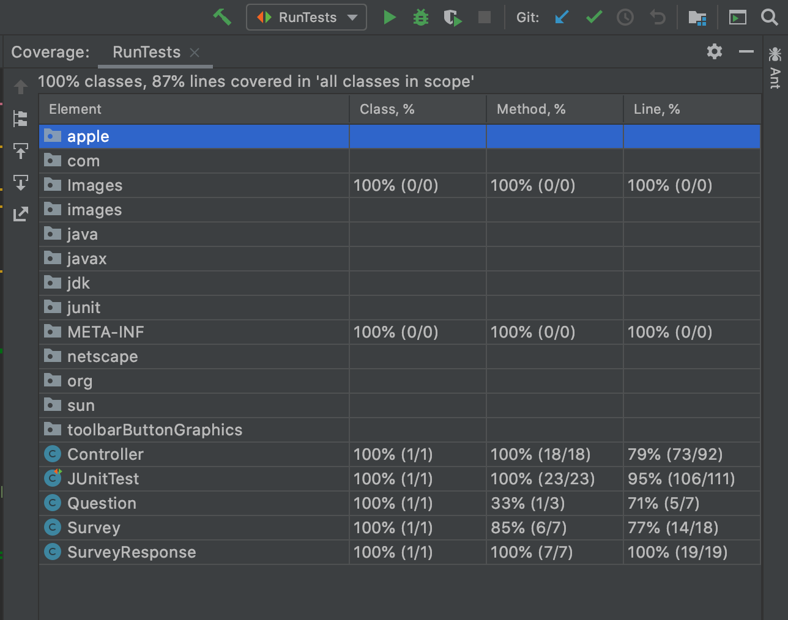

# SQAExam
Final Assignment for Software Quality Assurance module

## Introduction
As part of a Software Quality management plan for an organisation you have been asked to implement an example software project. This will be a reference guide for best practices that the rest of the team can refer to. The project will demonstrate the following topics:
* Scrum sprint backlog and task estimation
* Unit testing and Test-Driven development
* Test coverage metric
* Team version-control
* Code-review checklist
### Description
You are going to create a software component in Java for storing information about Surveys and Responses. Each Survey is made up of multiple Question (up to a maximum of 10). Every SurveyResponse should contain an answer to each Question in its Survey, where the answer will be an integer value between 1 and 5 (i.e. representing a Likert scale).
### Sprint Backlog
Sprint backlog contains a list of tasks, and the corresponding estimation associated with each task.
## Tasks and Estimations
* create a new Survey – 2
* add a question to a survey – 0.5
* get a list of all surveys – 3
* get a specific survey by name – 2
* creating a new SurveyResponse – 2
* adding an answer to a SurveyResponse – 1
* getting all SurveyResponses associated with a specific Survey – 3
* provide summary calculations including the
    1. Average – 1
    2. Standard Deviation – 2
    3. Maximum & Minimum – 1
* Finally provide summary for a specific question on a Survey
    1. Average – 0.5
    2. Standard Deviation – 0.5
    3. Maximum & Minimum – 0.5

### Task estimation
For the estimation of tasks I decided to go with the technique used by most agile teams, and use story points. Story points rate the relative effort of work in a Fibonacci-like format: 0, 0.5, 1, 2, 3, 5, 8, 13, 20, 40, 100. Each point would be roughly how much work a member could compete per hour. It is very useful as it forces the team involved to make tougher decisions around the difficulty of work;
* Once you agree on the relative effort of each story point value, you can assign points quickly without much debate.
* Story points reward team members for solving problems based on difficulty, not time spent. This keeps team members focused on shipping value, not spending time.

Because this is an individual assignment and there was no way to hold sprint meetings to collectively determine appropriate weightings for tasks I had to just create my own weightings and just trust I was estimating correctly. I based my estimations off some of the following factors;
* Have I done it before? Can I estimate from experience?
* Is it a key feature?
* Does it involve many or any CRUD elements?
* Are other features dependent on it?
* Include just one or two statements
* Includes a series of statements

I then quickly worked out how long I thought it might take me to complete each story point based on each individual task and assigned a weight accordingly. If I thought something would take 1 hour it got a score of 1, if it might take 2 then 2 points etc.

### Task Comparison for different estimates
1. Provide summary calculations for Standard Deviation – **2 Story points**
2. Standard Deviation for a specific question – **0.5 Story points**

I thought these would be good to highlight as they are tasks that I actually compared when estimating the weights, and they are practically the same task yet one was given a weight of 1.5 more. The reason for this is when thinking of the task the first question I asked myself was have I ever done anything like this before and the answer was no, I decided to add 1 to the total of this for self-learning time, and an addition 1 to implement the method. The second task, as it was similar, should not require any learning and therefore should be 1 less story point. However, as I felt much of the code and knowledge needed to implement it would already be available within the team, providing the tasks are done in the correct order, I assigned it a score of 0.5
### Velocity Metric Calculation
Velocity is the measure of the amount of work a Team can tackle during a single Sprint and is calculated at the end of the Sprint by totalling the Points for all fully completed User Stories. The calculation of the velocity metric can be worked out by first getting all the task that were fully complete and adding together all their respective weights. I.e. Two tasks complete weighted at 1 and 2 will equal 3. This number will then be divided by the number of sprints involved in completing the tasks, for this example we say it was all done in one sprint so the velocity of the team is then said to be 3/1 which equals 3.
This feeds into the preparation of the next sprint as we know to aim for a collection of tasks that equals no more than 3.

## Unit testing and Test-Driven development

Unit Testing involves testing individual units of behaviour. An individual unit of behaviour is the smallest possible unit of behaviour that can be individually tested in isolation.

*Test-driven development (TDD)* is a software development process that relies on the repetition of a very short development cycle. TDD involves letting your tests drive your development. You can do that with unit tests, functional tests and acceptance tests. The most important part of TDD is the driven part, the tests will tell you what to do, what to do next, and when you are done. 

The following sequence of steps is generally followed:
* Add a test
* Run all tests and see if the new one fails
* Write some code
* Run tests
* Refactor code
* Repeat
##Test Coverage Metric
Test coverage is defined as a metric in Software Testing that measures the amount of testing performed by a set of test. It will include gathering information about which parts of a program are executed when running the test suite to determine which branches of conditional statements have been taken.
InteliJ allows you to run test with coverage which can be added as a plugin.
1. Make sure that you have created the necessary run/debug configuration for your tests.
You can also run the necessary tests to generate a temporary run configuration that you can later modify and save.
2. Select the correct configuration in the list on the toolbar and select Run then Run ... with Coverage from the main menu.

3. InteliJ will then prompt you to select whether you want to replace the active coverage suites, add the collected data to the active suites, or not to apply coverage data.
Select whether you want to append the results of multiple runs and click OK.

[More info here...](https://www.jetbrains.com/help/idea/running-test-with-coverage.html)

#### Make sure you have created the necessary run/debug configuration for your tests.

#### Select the correct configuration in the list on the toolbar and click the Run with Coverage button, or select Run | Run ... with Coverage from the main menu.

#### The report shows the percentage of the code that has been covered by the tests. You can see the coverage result for classes, methods, and lines.

## Team Version Control
Branching, in version control and software configuration management, is the duplication of an object under version control so that modifications can occur in parallel along multiple branches. These are all the branches that were created for my project and how they fit in GitFlow.
#### *Master*
The default branch name in Git is master. The “master” branch in Git is not a special branch, it is where the project begins and where the final project containing all documentation and code will be at the end. No changes will be made directly to this branch but instead pull requests from the develop or hotfix branch will update it. Once the QA is satisfied with the quality, the release branch is merged into master. 
 Note: Any commit in master is a merge commit, either release or a hotfix branch, and represents a new release that would be put into production. As my documentation is all just text files I have branched them straight from here for easy merging but in general you should only merge from the develop or hotfix branches.
#### *Develop*
The develop branch is the stable developer's branch. In traditional source control software the develop branch is your repo server. It is the branch all developers have in common. It is the branch you start development with. This branch is where any near final changes are located before making it into the master branch this branch only takes pull requests from either the feature or release branch.
#### *Documentation*
This is similar to the develop branch, but instead it wil be used to handle changes in README file instead of code.
#### *Feature Branches*
All features / new functions / major refactoring’s are done in here in feature branches, which branch off and are merged back into the develop branch, after they are reviewed of course. 
#### *Release Branches*
When enough features have accumulated or the next release time frame comes near, a new release branch is branched off develop. It is solely dedicated to testing/bug fixing and any clean-up necessary.
#### *Hotfix* 
If a major problem is found after release, a quick fix can be developed in a hotfix branch, that is branched off the master. This is the only branch that should ever branch off of master. I have all my documentation branched from the master but as I mentioned before this is because they are only text files.

## Review Check List
Preforming code reviews can help ensure code is up to a high standard by giving a fresh set of eyes the chance to identify bugs and simple coding errors before your product gets to the next step. Just simply having someone reviewing your code and identifying possible errors is a great way to minimise mistakes and is good coding practice. As this is an individual assignment I will have to create and review my own code through a code review checklist.
Below is the checklist I followed when preforming code reviews on my own code.

#### 1. *Understandable*
Am I able to understand the code easily?
    
#### 2. *Coding Standards / Guidelines*
Is the code written following the coding standards/guidelines?
    
#### 3. *Duplicated Code*
Code duplication should be checked, if there is repeat code more than twice you should consisder making a method for this task.

#### 4. *Unit test / Debug*
Can I unit test / debug the code easily to find the root cause of any issues?

#### 5. *Too Big?*
Is this function or class too big? If yes, is the function or class having too many responsibilities?

#### 6. *Match Requirement*
Does the code provided match the functional requirements? This may seem like common sense but it is easy to get lost while coding and is important to check back to base every now and again to see if you are still on the right path.

#### 7. *Document all code review comments*
Documenting will help software developers to cross check the highlighted issues and avoid making similar mistakes in future.

#### 8. *Always be patient and relook if required*
This is especially true for me as I am preforming code reviews on code I have just written, and it will be very easy to overlook issues, so it is important to take my time and think critically.

#### Implementation
I will preform code reviews when I have created my pull requests. Making sure to check off each of the above topics as I do so.
The code review process should always be pursued in a constructive way by all stakeholders to gain maximum benefit.
The code review process not only improves the software quality but also helps software developers to enhance their skills continuously. This is why many organizations/project managers must ensure that code reviews are an integral part of software development lifecycle.

